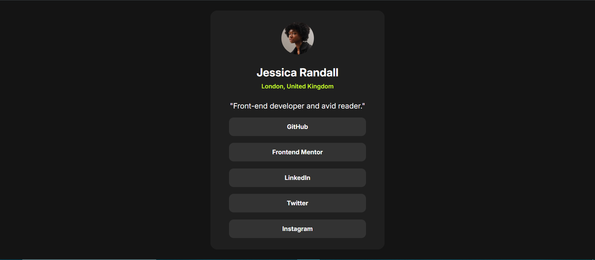

# Frontend Mentor - Social links profile solution

This is a solution to the [Social links profile challenge on Frontend Mentor](https://www.frontendmentor.io/solutions/css-flexbox-JOWsemVvBU). Frontend Mentor challenges help you improve your coding skills by building realistic projects. 

## Table of contents

- [Overview](#overview)
  - [The challenge](#the-challenge)
  - [Screenshot](#screenshot)
  - [Links](#links)
  - [Built with](#built-with)
  - [What I learned](#what-i-learned)
  - [Continued development](#continued-development)
- [Author](#author)

## Overview

### The challenge

Users should be able to:

- See hover and focus states for all interactive elements on the page

### Screenshot

*

### Links

- Solution URL: [Add solution URL here](https://your-solution-url.com)
- Live Site URL: [https://avinashinnovator13.github.io/Social-profile/](https://avinashinnovator13.github.io/Social-profile/)

## My process

### Built with

- Semantic HTML5 markup
- CSS custom properties
- Flexbox
- CSS Grid

### What I learned

I learned some layout hacks used to center the objects or elements in CSS.
### Continued development

I would expand my knowledge of layout in my upcomming challenges.

## Author

- Frontend Mentor - [@AvinashInnovator13](https://www.frontendmentor.io/profile/AvinashInnovator13)
- Twitter - [@AvinashKum59070](https://x.com/AvinashKum59070)

